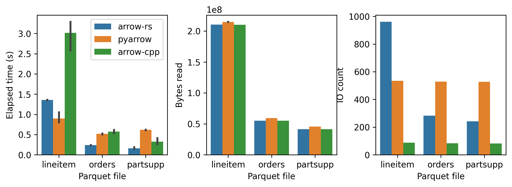

# Parquet Gym

🏋️ Exercise your parquet readers!


## Run benchmark
```bash
# Build docker image
docker build -t parquet-gym .

# Run benchmark
docker run -v ./results:/app/results parquet-gym 
```

The benchmark results are saved to `./results` folder, with one parquet file paired with a json file (human readable). 

## Leaderboard
todo: current benchmark does not look right, pyarrow is faster than arrow-cpp, which is not possible.


## Gym equipments
### Supported Parquet readers
- [pyarrow](https://arrow.apache.org/docs/python/parquet.html)
- [arrow-rs](https://docs.rs/parquet/latest/parquet/)
- [arrow-cpp](https://github.com/apache/arrow/tree/main/cpp/src/parquet)

todo: parquet-go? DuckDB?
todo: how to add a new reader?

### Supported workloads
- Sample data.
- TPC-H (default scale factor: 1)

todo: TPC-H, NYX-taxi, etc.

### Supported metrics
- Elapsed time (wall time)

todo: CPU time, memory usage, disk IO bandwidth, disk IO count.

