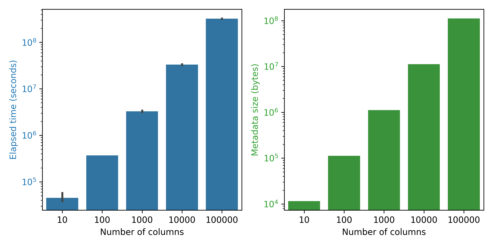

# Parquet Format Studies

Here we want to study the parquet format, specifically, answer the following questions:
1. How expensive it is to decode parquet metadata with wide columns (e.g., > 10k columns)? 


### Wide-table study

#### Why?
<!-- Parquet is used in machine learning workloads to store [vector embeddings](https://huggingface.co/datasets?sort=downloads&search=embed), each vector is an array of floating numbers. -->
<!-- For a vector with 10k dimensions, we have 10k columns in the parquet schema. (This is not true: vector embeddings are stored as lists in Parquets' nested model.) -->
<!-- (personal note: I don't think this is the intended use case for parquet) -->

It is common to store a large number of features (thousands of key-value pairs) for ML training in ORC/Parquet format.
(Section 5.5 in paper: https://www.vldb.org/pvldb/vol17/p148-zeng.pdf)

#### To run and get numbers

1. Setup python environment:
```bash
curl -LsSf https://astral.sh/uv/install.sh | sh
uv venv
uv pip install -r ../requirements.txt
source .venv/bin/activate
```

2. Generate parquet files in the `target/parquet_files` directory.
```bash
python python/wide_table_study.py generate --output_dir target/parquet_files
```

3. Run the benchmark using the generated parquet files. The results are saved to the `target/wide_table_bench` directory.
```bash
python python/wide_table_study.py benchmark --input_dir target/parquet_files --output_dir target/wide_table_bench/
```

4. Plot the figure. Use the benchmark results to generate a figure.
```bash
python python/wide_table_study.py plot --input_dir target/wide_table_bench/ --output_dir target/wide_table_figure
```

We will get something like this:



#### Where did time go?
(working-in-progress)

Generate a flamegraph:
```bash
cargo flamegraph --root --bench metadata -- 100000
```

As [@tustvold](https://github.com/tustvold) pointed out in [this issue](https://github.com/apache/arrow-rs/issues/5775), reading Parquet metadata incurs a lot of allocations.

We can demonstrate this by using a better allocator (e.g., [mimalloc](https://github.com/purpleprotocol/mimalloc_rust)) to see the performance gap. 

To benchmark with `mimalloc`
```bash
cargo bench --bench metadata --features "mimalloc"
```

