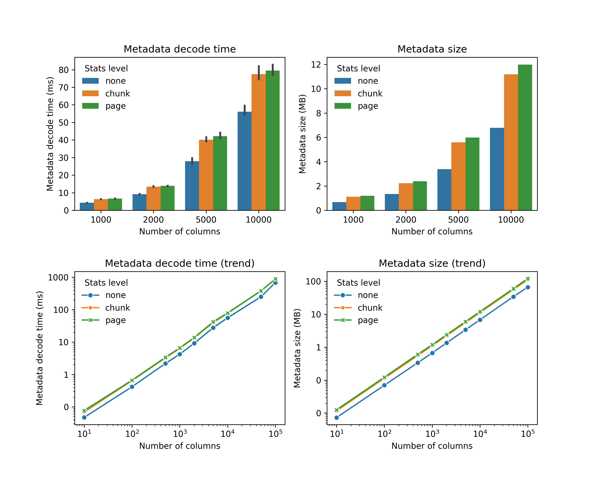
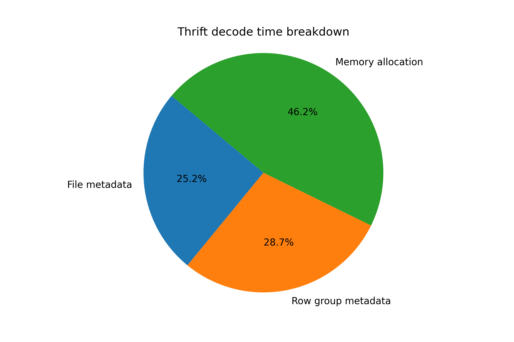

# Parquet Format Studies

Here we want to study the parquet format, specifically, answer the following questions:
1. How expensive it is to decode parquet metadata with wide columns (e.g., > 10k columns)? 


### Wide-table study

#### Why?
<!-- Parquet is used in machine learning workloads to store [vector embeddings](https://huggingface.co/datasets?sort=downloads&search=embed), each vector is an array of floating numbers. -->
<!-- For a vector with 10k dimensions, we have 10k columns in the parquet schema. (This is not true: vector embeddings are stored as lists in Parquets' nested model.) -->
<!-- (personal note: I don't think this is the intended use case for parquet) -->

It is common to store a large number of features (thousands of key-value pairs) for ML training in ORC/Parquet format.
(Section 5.5 in paper: https://www.vldb.org/pvldb/vol17/p148-zeng.pdf)

#### To run and get numbers

Setup python environment:
```bash

```

#### Benchmark

Run the following command to measure the time it takes to decode the parquet metadata with column number ranging from 10 to 100k. 
```bash
cargo bench --bench metadata
```

To plot the results, run the following command:
```bash
python python/plot_result.py
```
(todo: how to setup python environment)

We will get the following figure.
It clearly shows that the time to decode the metadata is positively correlated with the number of columns in the parquet file.


#### Where did time go?
(working-in-progress)

Generate a flamegraph:
```bash
cargo flamegraph --root --bench metadata -- 100000
```

As [@tustvold](https://github.com/tustvold) pointed out in [this issue](https://github.com/apache/arrow-rs/issues/5775), reading Parquet metadata incurs a lot of allocations.

We can demonstrate this by using a better allocator (e.g., [mimalloc](https://github.com/purpleprotocol/mimalloc_rust)) to see the performance gap. 

To benchmark with `mimalloc`
```bash
cargo bench --bench metadata --features "mimalloc"
```

We can generate the following figure.


